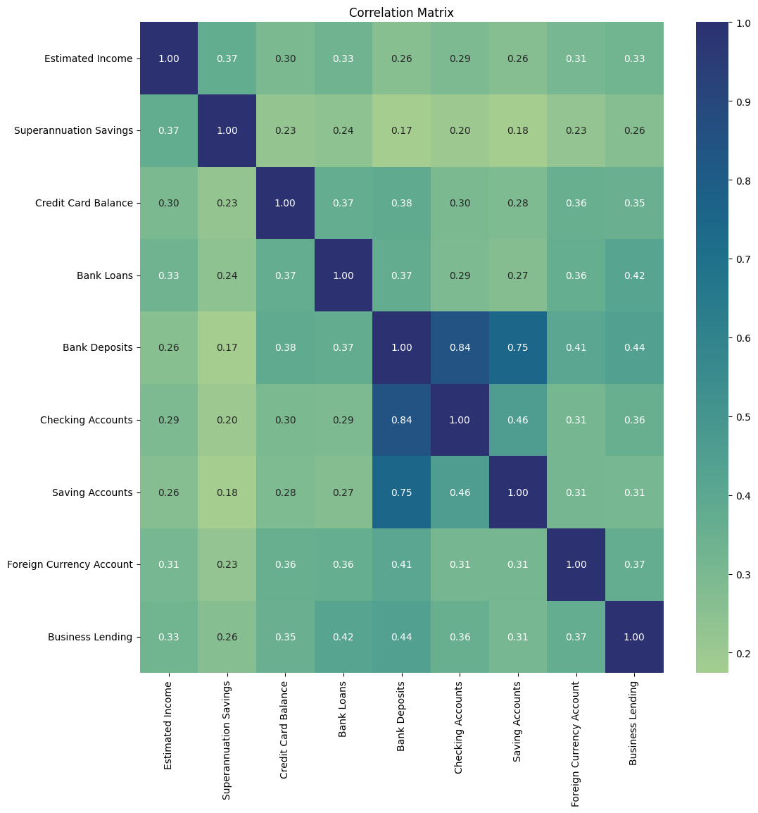

# Banking Risk Analytics: MySQL Integration, EDA & Customer Insights
 
An end-to-end risk analytics project analyzing **3,000 banking clients** across **25 features** to understand customer risk profiles, financial behavior patterns, and lending exposure. Built with a **MySQL → Python pipeline** demonstrating database integration, data cleaning, feature engineering, and comprehensive EDA.
 
**Author:** Hitik Sharma | M.Sc. Computer Science, University of Passau  
**GitHub:** [github.com/hitiksharma](https://github.com/hitiksharma)
 
---
 
## Project Overview
 
**Problem Statement:** Banks need a data-driven understanding of risk analytics to minimize the risk of losing money while lending to customers. Understanding customer financial behavior, risk profiles, and product relationships is essential for informed lending decisions.
 
**Solution:** Built a complete data pipeline from MySQL database through Python analysis to produce actionable risk insights across demographics, financial products, and customer segments.
 
**Pipeline:**
```
Data (CSV/Excel) → MySQL Database → Python (SQLAlchemy Connector) → 
Data Cleaning & Feature Engineering → EDA (Univariate + Bivariate + Correlation) → Insights
```
 
---
 
## Dataset Summary
 
| Metric | Value |
|--------|-------|
| Total Clients | **3,000** |
| Features | **25** |
| Age Range | 17–85 years (Mean: 51) |
| Average Income | **$171,305** |
| Average Bank Deposits | **$671,560** |
| Average Bank Loans | **$591,386** |
| Nationalities | 5 (European, Asian, American, Australian, African) |
| Loyalty Tiers | 4 (Jade, Silver, Gold, Platinum) |
 
---
 
## Key Insights
 
### Customer Demographics
- **European clients dominate** at 44% (1,309), followed by Asian (25%) and American (17%)
- Near-equal **gender split**: 50.4% vs 49.6%
- **75% of clients are above age 69** — the customer base skews significantly older
- Age range spans 17–85, with a mean of 51
### Financial Product Patterns
- **Bank Deposits ↔ Checking Accounts: 0.84 correlation** — customers with large deposits also maintain large checking balances
- **Bank Deposits ↔ Saving Accounts: 0.75 correlation** — similar cross-product holding pattern
- This tells us: **customers who maintain large balances in one account type often hold substantial funds across all account types**
- **Superannuation Savings** has the weakest correlation with other financial products (0.17–0.37)
### Credit & Risk Profile
- **64% of clients hold only 1 credit card** — low credit product diversification
- **41% are Risk Weighting level 2** (moderate risk), only 5% at level 5 (highest risk)
- Females have marginally more credit cards than males (close numbers)
- Americans and Asians have equal distribution of 3 credit cards
### Loyalty & Fee Insights
- **44% are Jade tier** (entry-level loyalty), only **11% reach Platinum**
- **49% pay High fees** — opportunity to investigate if fee structure correlates with churn risk
- Low-fee clients represent only 19% — potential upsell or retention segment
### Income Segmentation (Feature Engineering)
- Created Income Bands: Low (<$100K), Medium ($100K–$300K), High (>$300K)
- Distribution shows concentration in Low and Medium bands
---
 
## Correlation Heatmap
 

 
**Strongest Correlations:**
| Pair | Correlation |
|------|------------|
| Bank Deposits ↔ Checking Accounts | **0.84** |
| Bank Deposits ↔ Saving Accounts | **0.75** |
| Checking Accounts ↔ Saving Accounts | **0.46** |
| Bank Deposits ↔ Business Lending | **0.44** |
| Bank Loans ↔ Business Lending | **0.42** |
 
---
 
## Technical Implementation
 
### MySQL Database Setup
- Loaded banking data into MySQL database (`banking_case`)
- Created `banking_data` table with all 25 columns
- Connected Python to MySQL using `mysql-connector-python` and `SQLAlchemy`
### Python EDA Pipeline
- **Data Profiling:** Shape, dtypes, null checks, descriptive statistics
- **Feature Engineering:** Income banding (Low/Med/High categorical bins)
- **Univariate Analysis:** Distribution plots for all categorical variables
- **Bivariate Analysis:** Cross-tabulations by gender, nationality, and product usage
- **Numerical Analysis:** Distribution plots for all financial metrics
- **Correlation Analysis:** Heatmap revealing cross-product holding patterns
---
 
## Repository Structure
 
```
Banking-Risk-Analytics/
├── README.md
├── Banking_Domain.ipynb          # Complete EDA notebook (Google Colab)
├── Banking.ipynb                 # MySQL connection & data extraction
├── Banking.csv                   # Source dataset
├── Banking.xlsx                  # Excel version of dataset
├── clients.csv                   # Client reference data
├── Correlation.png               # Correlation heatmap visualization
├── mysql_python_connection_guide.docx  # MySQL-Python setup guide
├── ER_diagram_banking.png        # MySQL table structure
```
 
---
 
## How to Run
 
```bash
git clone https://github.com/hitiksharma/Banking-Risk-Analytics.git
cd Banking-Risk-Analytics
 
pip install pandas numpy matplotlib seaborn mysql-connector-python sqlalchemy pymysql
 
# For MySQL integration: set up local MySQL and update credentials in Banking.ipynb
# For standalone EDA: open Banking_Domain.ipynb in Jupyter/Colab
```
 
---
 
## Tools & Technologies
 
- **Database:** MySQL (data storage and querying)
- **Python:** pandas, NumPy, matplotlib, seaborn
- **Connectors:** mysql-connector-python, SQLAlchemy, PyMySQL
- **Analysis:** EDA, feature engineering, correlation analysis, customer segmentation
- **Environment:** Google Colab, MySQL Workbench
---
 
## License
This project is for educational and portfolio purposes.
